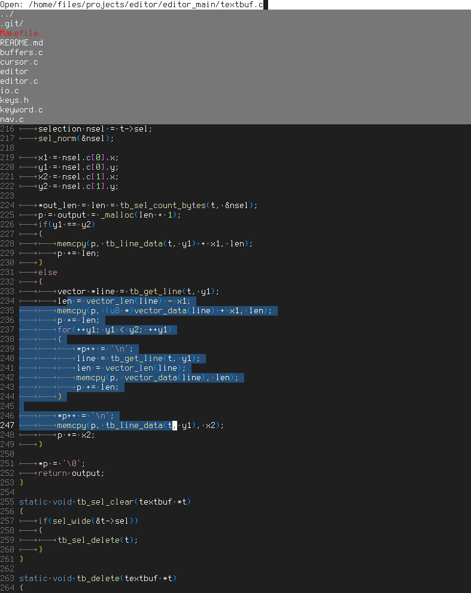

# editor

The goal of this project is to create a lightweight code editor written in C,
that is optimized for C projects, is performant, and productive.

**This is what it looks like editing its own source code:**



## TODO

### Today
- String Library (replace strcat!!)
- Config File

### Tomorrow
- Command mode ctrl+t
- More Tests
- Make vec faster
- Align defines handle comments
- Convert upper, lower, camel snake case automagically
- Indent Selected using Tab (small bug with cursors)
- Shift tab work with spaces
- Installation Package Generator, Linux + Windows Release Build 64 bit
	- Version
	// mingw-w64-sdl2_ttf
	Editor-V104-Windows-x86_64.zip
	Editor-V104-Linux-x86_64.zip

### Think this through

- Side bar for file manager (Ctrl+b)
	- Menu System Overhaul
	- Mouse Support in menus
	- Bottom Line crash bug
	- Open Files
	- File browser

### Later

- Search and replace in file and whole folder
- Undo / Redo
- Multiple Cursors
- Minimap

## Project overview

### Abbreviations

Two or three letter abbreviations are used as a module prefix.

```
BF  = Buffer Management [buffers.c]
TB  = Text Buffer [textbuf.c]

TF  = Text Field [textfld.c]
DD  = Dropdown Menu [dropdown.c]

GT  = Go to location [goto.c]
OB  = Open Buffers [opened.c]
CF  = Confirmation dialog [confirm.c]
MSG = Message (Error or Info) [msg.c]

VEC = Vector (Dynamic array) [vector.c]
KW  = Keyword hashtable (for syntax highlighting) [keyword.c]

SR  = Search and Replace [search.c]
SV  = Save File (As) [save_as.c]
OP  = Open File [open.c]
RR  = Rendering [render.c]
CR  = Cursor [cursor.c]
SEL = Selection [cursor.c]
```

### Common Functions

`example_init`\
Initialize example (for the first time)

`example_destroy`\
Cleanup example, when it is no longer used (Free memory, etc.)

`example_key`\
Example receives a keypress

`example_open`\
Make example visible on the screen and focus it

`example_clear`\
Reset example to initial state
(For example, text field to empty string)

`example_render`\
Example is rendered to the screen
