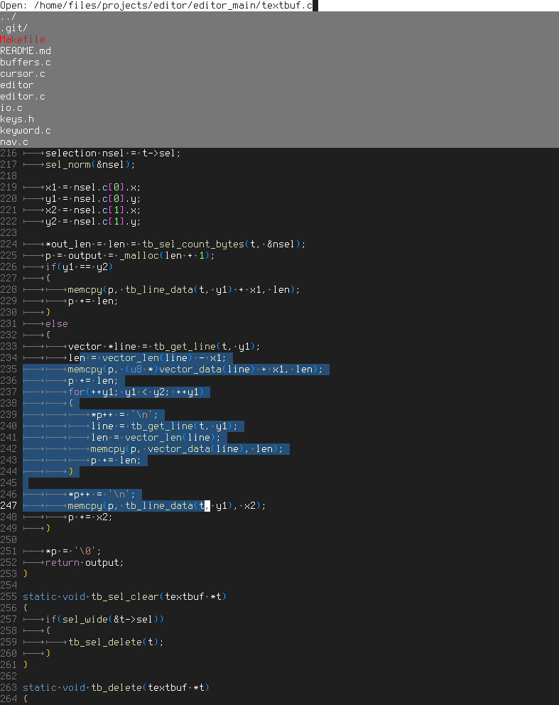

# editor

The goal of this project is to create a lightweight code editor written in C,
that is optimized for C projects, is performant, and productive.

**This is what it looks like editing its own source code:**



## Project overview

### Code style

Global variables are prefixed with an underscore. When a global
variable is used only in one module, it is begins with the module
prefix (for example `_sr_tf_replace` is the text field for the
search and replace module, that contains the replacement string).

I like to separate declaration and initialization of variables.
This allows to insert statements at the start of the block before
anything else happens.

The whole project is a single compilation unit. There are no header
files, I directly include C files. Since every function is static,
the optimizations by the compiler are much better.

I don't like to use `const` in C, because it is broken. For example,
if I have a function that finds the last word in a string and
returns a pointer to it. The function itself does not modify the
string, so it makes sense to make the parameter `const`, right?
So the signature would look like this:

`const char *find_last_word(const char *s);`

No! Because what if I want to use that function to find the word
and capitalize it for example? That doesn't work because the
returned pointer is const. This is a contrived example but such
things happen a lot.

Another example is having a function that takes a substring
of a string and needs to pass it to another function which
accepts a null-terminated string (and does not modify it).
Copying the string just to add a null terminator would be
inefficient, so one can just save the character after the
substring, put a null there, and after the call restore character
that was there previously. So effectively, the string is modified,
but after the execution it is the same as before.

Of course it is possible to cast away the const, but that defeats the
point.

### Abbreviations Index

I use two (or three) letter abbreviations as a module prefix.

```
BF  = Buffer Management [buffers.c]
TB  = Text Buffer [textbuf.c]
TF  = Text Field [textfld.c]
SR  = Search and Replace [search.c]
SV  = Save File (As) [savefile.c]
OP  = Open File [openfile.c]
OB  = Open Buffers [openbufs.c]
IO  = Input / Output (Platform dependant) [io.c]
RR  = Rendering [render.c]
GT  = Go to location [goto.c]
KW  = Keyword hashtable (for syntax highlighting) [keyword.c]
DD  = Dropdown Menu [dropdown.c]
CF  = Confirmation dialog [confirm.c]
MSG = Message (Error or Info) [msg.c]
CR  = Cursor [cursor.c]
SEL = Selection [cursor.c]
```

### Common Functions

`example_init`\
Initialize example (for the first time)

`example_destroy`\
Cleanup example, when it is no longer used (Free memory, etc.)

`example_key`\
Example receives a keypress

`example_open`\
Make example visible on the screen and focus it

`example_clear`\
Reset example to initial state
(For example, text field to empty string)

`example_render`\
Example is rendered to the screen

## TODO

### Textbuffer
- Ctrl+C Copy current line
- Indent Selected using Tab

### Modes
- Search and replace in file and whole folder

### Future
- Fix unicode problems
- Undo / Redo
- Multiple Cursors
